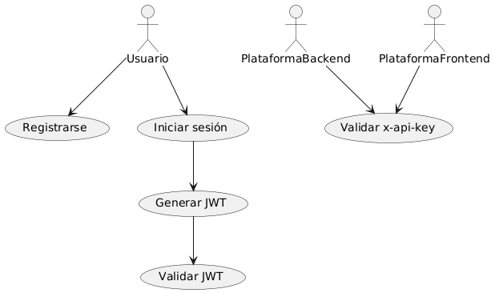
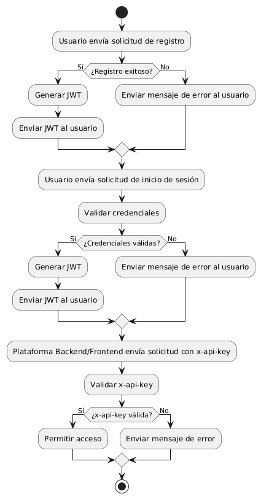
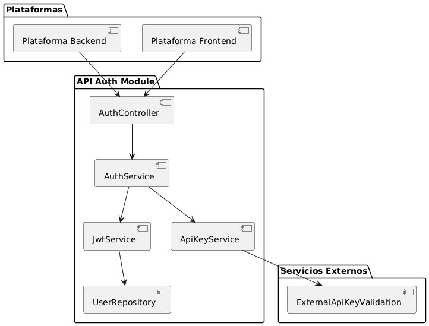
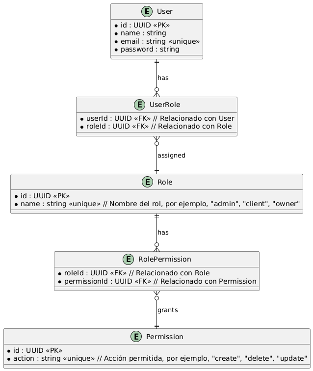

# inmobiliariaRiwiAuth
## Diagramas Uml
### Diagrama de Casos de Uso
Este diagrama ilustra las interacciones entre los actores y la API Auth.

### Diagrama de Flujo
Este diagrama muestra el flujo de autenticación y validación de x-api-key.

### Diagrama de Arquitectura
Este diagrama muestra la arquitectura general de la API Auth, incluyendo la integración con otros servicios.

### Diagrama de Modelos de Datos (ER)
Este diagrama muestra los modelos de datos relevantes para la API Auth.

### Resumen
- Diagrama de Casos de Uso: Muestra cómo los usuarios y plataformas interactúan con la API Auth.
- Diagrama de Flujo: Detalla el proceso de autenticación y validación de x-api-key.
- Diagrama de Arquitectura: Representa la estructura general y las interacciones de la API Auth con otros servicios.
- Diagrama de Modelos de Datos: Muestra los modelos de datos principales y sus relaciones.
